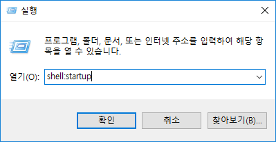

## 카카오톡 광고 제거기

우선 메인화면에 제일 하단에 있는 광고만 지우도록 했음.

추가적인 광고가 있다면 지우도록 할 예정.

## 시작 프로그램 동록 방법

1. Win + R을 누르고 `shell:startup`을 입력한다.

2. `adsremover.exe`를 시작프로그램 폴더에 넣는다.
3. 아래와 같은 트레이 아이콘이 생기면 성공.

## 문제점

1. 배경이 검은 곳에서 보면 광고가 제거된 곳에 왼쪽, 오른쪽 하단에 하얀색 점이 보인다.